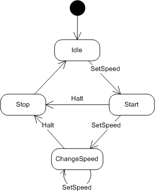
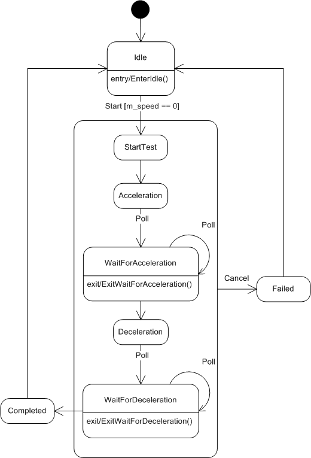

# State Machine Design in C++
A compact C++ finite state machine (FSM) implementation that's easy to use on embedded and PC-based systems.

Originally published on CodeProject at: <a href="https://www.codeproject.com/Articles/1087619/State-Machine-Design-in-Cplusplus"><strong>State Machine Design in C++</strong></a>

Based on original design published in C\C++ Users Journal (Dr. Dobb's) at: <a href="http://www.drdobbs.com/cpp/state-machine-design-in-c/184401236"><strong>State Machine Design in C++</strong></a>

See related compact state machine Git project <a href="https://github.com/endurodave/StateMachineCompact"><strong>here</strong></a>.

<h2>Introduction&nbsp;</h2>

In 2000, I wrote an article entitled &quot;<em>State Machine Design in C++</em>&quot; for C/C++ Users Journal (R.I.P.). Interestingly, that old article is still available and (at the time of writing this article) the #1 hit on Google when searching for C++ state machine. The article was written over 15 years ago, but I continue to use the basic idea on numerous projects. It&#39;s compact, easy to understand and, in most cases, has just enough features to accomplish what I need.&nbsp;

This article provides a new implementation with updated features at the slight expense of a bit more code. I&#39;ll also correct the errors in the original implementation because if you&#39;re really tight on storage it&rsquo;s still be a viable solution. Both designs are table driven suitable for any platform, embedded or PC, with any C++ compiler.&nbsp;

Why another state machine design? Certainly by now there&#39;s an existing implementation out there that can be used, right? Maybe. On occasion, I&#39;ll try a new state machine and find it doesn&#39;t fit my needs for one reason or another. For me, the problem usually boils down to one or more of the following:

<ol>
	<li><strong>Too large</strong> &ndash; the resulting implementation takes too much code space to justify on an embedded platform.</li>
	<li><strong>Too complex</strong> &ndash; excessive templates or requires adoption of a complete framework to use the state machine.</li>
	<li><strong>No compiler support </strong>&ndash; relies upon new C++ language features not supported by the compiler.</li>
	<li><strong>High learning curve</strong> &ndash; some require quite a lot of effort in this regard.&nbsp;</li>
	<li><strong>Difficult syntax </strong>&ndash; non-intuitive state machine expression with hard to diagnose compiler errors.&nbsp;</li>
	<li><strong>External libraries</strong> &ndash; relies upon external libraries that add size or aren&#39;t supported on the platform.</li>
	<li><strong>Too many features </strong>&ndash; full UML compliance isn&#39;t required and therefore exceeds the basic needs of the problem at hand.&nbsp;</li>
	<li><strong>No event data</strong> &ndash; can&#39;t send unique event data to a state function.</li>
	<li><strong>Central event handler </strong>&ndash; a single event handling function and a switch statement handles events for each class.</li>
	<li><strong>No type safety </strong>&ndash; requires manual typecasting the event data based on an enumeration.</li>
	<li><strong>Limited transition rules </strong>&ndash; no support for event ignored and can&#39;t happen event transitions.&nbsp;</li>
	<li><strong>No thread-safety </strong>&ndash; the code is not thread-safe.&nbsp;</li>
</ol>

Don&#39;t get me wrong, some implementations are quite impressive and suitable for many different projects. Every design has certain tradeoffs and this one is no different. Only you can decide if this one meets your needs or not. I&#39;ll try to get you bootstrapped as quickly as possible through this article and sample code. This state machine has the following features:

<ol>
	<li><strong>Compact</strong> &ndash; the StateMachine class is not a template &ndash; only 448 bytes of code on Windows. Templates are used sparingly.&nbsp;</li>
	<li><strong>Transition tables</strong> &ndash; transition tables precisely control state transition behavior.&nbsp;</li>
	<li><strong>Events </strong>&ndash; every event is a simple public instance member function with any argument types.&nbsp;</li>
	<li><strong>State action</strong> &ndash; every state action is a separate instance member function with a single, unique event data argument if desired.</li>
	<li><strong>Guards/entry/exit actions</strong> &ndash; optionally a state machine can use guard conditions and separate entry/exit action functions for each state.</li>
	<li><strong>State machine inheritance </strong>&ndash; supports inheriting states from a base state machine class.&nbsp;</li>
	<li><strong>State function inheritance </strong>&ndash; supports overriding a state function within a derived class.&nbsp;</li>
	<li><strong>Macros </strong>&ndash; optional multiline macro support simplifies usage by automating the code &quot;machinery&quot;.</li>
	<li><strong>Type safe </strong>&ndash; compile time checks catch mistakes early. Runtime checks for the other cases.&nbsp;</li>
	<li><strong>Thread-safe </strong>&ndash; adding software locks to make the code thread-safe is easy.</li>
</ol>

This state machine design is not trying to achieve a full UML feature set. It is also not a Hierarchical State Machine (HSM). Instead, its goal is to be relatively compact, portable, and easy to use traditional Finite State Machine (FSM) with just enough unique features to solve many different problems.&nbsp;

The article is not a tutorial on the best design decomposition practices for software state machines. I&#39;ll be focusing on state machine code and simple examples with just enough complexity to facilitate understanding the features and usage.&nbsp;

<h2>Background&nbsp;</h2>

A common design technique in the repertoire of most programmers is the venerable finite state machine (FSM). Designers use this programming construct to break complex problems into manageable states and state transitions. There are innumerable ways to implement a state machine.&nbsp;

A switch statement provides one of the easiest to implement and most common version of a state machine. Here, each case within the switch statement becomes a state, implemented something like:

<pre lang="c++">
switch (currentState) {
   case ST_IDLE:
       // do something in the idle state
       break;
    case ST_STOP:
       // do something in the stop state
       break;
    // etc...
}</pre>

This method is certainly appropriate for solving many different design problems. When employed on an event driven, multithreaded project, however, state machines of this form can be quite limiting.

The first problem revolves around controlling what state transitions are valid and which ones are invalid. There is no way to enforce the state transition rules. Any transition is allowed at any time, which is not particularly desirable. For most designs, only a few transition patterns are valid. Ideally, the software design should enforce these predefined state sequences and prevent the unwanted transitions. Another problem arises when trying to send data to a specific state. Since the entire state machine is located within a single function, sending additional data to any given state proves difficult. And lastly these designs are rarely suitable for use in a multithreaded system. The designer must ensure the state machine is called from a single thread of control.

<h2>Why use a state machine?</h2>

Implementing code using a state machine is an extremely handy design technique for solving complex engineering problems. State machines break down the design into a series of steps, or what are called states in state-machine lingo. Each state performs some narrowly defined task. Events, on the other hand, are the stimuli, which cause the state machine to move, or transition, between states.&nbsp;

To take a simple example, which I will use throughout this article, let&#39;s say we are designing motor-control software. We want to start and stop the motor, as well as change the motor&#39;s speed. Simple enough. The motor control events to be exposed to the client software will be as follows:

<ol>
	<li><strong>Set Speed</strong> &ndash; sets the motor going at a specific speed.</li>
	<li><strong>Halt </strong>&ndash; stops the motor.</li>
</ol>

These events provide the ability to start the motor at whatever speed desired, which also implies changing the speed of an already moving motor. Or we can stop the motor altogether. To the motor-control class, these two events, or functions, are considered external events. To a client using our code, however, these are just plain functions within a class.&nbsp;

These events are not state machine states. The steps required to handle these two events are different. In this case the states are:

<ol>
	<li><strong>Idle </strong>&mdash; the motor is not spinning but is at rest.</li>
</ol>

<ul>
	<li>Do nothing.</li>
</ul>

<ol start="2">
	<li><strong>Start </strong>&mdash; starts the motor from a dead stop.</li>
</ol>

<ul>
	<li>Turn on motor power.</li>
	<li>Set motor speed.</li>
</ul>

<ol start="3">
	<li><strong>Change Speed </strong>&mdash; adjust the speed of an already moving motor.</li>
</ol>

<ul>
	<li>Change motor speed.</li>
</ul>

<ol start="4">
	<li><strong>Stop </strong>&mdash; stop a moving motor.</li>
</ol>

<ul>
	<li>Turn off motor power.</li>
	<li>Go to the Idle state.</li>
</ul>

As can be seen, breaking the motor control into discreet states, as opposed to having one monolithic function, we can more easily manage the rules of how to operate the motor.

Every state machine has the concept of a &quot;current state.&quot; This is the state the state machine currently occupies. At any given moment in time, the state machine can be in only a single state. Every instance of a particular state machine class can set the initial state during construction. That initial state, however, does not execute during object creation. Only an event sent to the state machine causes a state function to execute.

To graphically illustrate the states and events, we use a state diagram. Figure 1 below shows the state transitions for the motor control class. A box denotes a state and a connecting arrow indicates the event transitions. Arrows with the event name listed are external events, whereas unadorned lines are considered internal events. (I cover the differences between internal and external events later in the article.)

 
&nbsp; 
<strong>Figure 1: Motor state diagram&nbsp;</strong>

As you can see, when an event comes in the state transition that occurs depends on state machine&#39;s current state. When a SetSpeed event comes in, for instance, and the motor is in the Idle state, it transitions to the Start state. However, that same SetSpeed event generated while the current state is Start transitions the motor to the ChangeSpeed state. You can also see that not all state transitions are valid. For instance, the motor can&#39;t transition from ChangeSpeed to Idle without first going through the Stop state.

In short, using a state machine captures and enforces complex interactions, which might otherwise be difficult to convey and implement.

<h2>Internal and external events</h2>

As I mentioned earlier, an event is the stimulus that causes a state machine to transition between states. For instance, a button press could be an event. Events can be broken out into two categories: external and internal. The external event, at its most basic level, is a function call into a state-machine object. These functions are public and are called from the outside or from code external to the state-machine object. Any thread or task within a system can generate an external event. If the external event function call causes a state transition to occur, the state will execute synchronously within the caller&#39;s thread of control. An internal event, on the other hand, is self-generated by the state machine itself during state execution.

A typical scenario consists of an external event being generated, which, again, boils down to a function call into the class&#39;s public interface. Based upon the event being generated and the state machine&#39;s current state, a lookup is performed to determine if a transition is required. If so, the state machine transitions to the new state and the code for that state executes. At the end of the state function, a check is performed to determine whether an internal event was generated. If so, another transition is performed and the new state gets a chance to execute. This process continues until the state machine is no longer generating internal events, at which time the original external event function call returns. The external event and all internal events, if any, execute within the caller&#39;s thread of control.

Once the external event starts the state machine executing, it cannot be interrupted by another external event until the external event and all internal events have completed execution if locks are used. This run to completion model provides a multithread-safe environment for the state transitions. Semaphores or mutexes can be used in the state machine engine to block other threads that might be trying to be simultaneously access the same object. See source code function <code>ExternalEvent()</code> comments for where the locks go.&nbsp;

<h2>Event data</h2>

When an event is generated, it can optionally attach event data to be used by the state function during execution. Once the state has completed execution, the event data is considered used up and must be deleted. Therefore, any event data sent to a state machine must be created on the heap, via operator new, so that the state machine can delete it once used. In addition, for our particular implementation the event data must inherit from the <code>EventData </code>base class. This gives the state machine engine a common base class for which to delete all event data.

<pre lang="c++">
class EventData 
{
public:
    virtual ~EventData() {}
};</pre>

The state machine implementation now has a build option that removes the requirement to create external event data on the heap. See the <strong>External event no heap data</strong>&nbsp;section for details.&nbsp;

<h2>State transitions</h2>

When an external event is generated, a lookup is performed to determine the state transition course of action. There are three possible outcomes to an event: new state, event ignored, or cannot happen. A new state causes a transition to a new state where it is allowed to execute. Transitions to the existing state are also possible, which means the current state is re-executed. For an ignored event, no state executes. However, the event data, if any, is deleted. The last possibility, cannot happen, is reserved for situations where the event is not valid given the current state of the state machine. If this occurs, the software faults.

In this implementation, internal events are not required to perform a validating transition lookup. The state transition is assumed to be valid. You could check for both valid internal and external event transitions, but in practice, this just takes more storage space and generates busywork for very little benefit. The real need for validating transitions lies in the asynchronous, external events where a client can cause an event to occur at an inappropriate time. Once the state machine is executing, it cannot be interrupted. It is under the control of the class&#39;s private implementation, thereby making transition checks unnecessary. This gives the designer the freedom to change states, via internal events, without the burden of updating transition tables.

<h2>StateMachine class</h2>

Two base classes are necessary when creating your own state machine: <code>StateMachine </code>and <code>EventData</code>. A class inherits from <code>StateMachine </code>to obtain the necessary mechanisms to support state transitions and event handling. The <code>StateMachine </code>header also contains various preprocessor multiline macros to ease implementation of the state machine (explained later in the article). To send unique data to the state functions, the structure must inherit from the <code>EventData </code>base class.

The state machine source code is contained within the StateMachine.cpp and StateMachine.h files (see attached <em>StateMachine.zip</em>). The code below shows the class declaration.

<pre lang="c++">
class StateMachine 
{
public:
    enum { EVENT_IGNORED = 0xFE, CANNOT_HAPPEN };

    StateMachine(BYTE maxStates, BYTE initialState = 0);
    virtual ~StateMachine() {}

    BYTE GetCurrentState() { return m_currentState; }
    
protected:
    void ExternalEvent(BYTE newState, const EventData* pData = NULL);
    void InternalEvent(BYTE newState, const EventData* pData = NULL);
    
private:
    const BYTE MAX_STATES;
    BYTE m_currentState;
    BYTE m_newState;
    BOOL m_eventGenerated;
    const EventData* m_pEventData;

    virtual const StateMapRow* GetStateMap() = 0;
    virtual const StateMapRowEx* GetStateMapEx() = 0;
    
    void SetCurrentState(BYTE newState) { m_currentState = newState; }

    void StateEngine(void);     
    void StateEngine(const StateMapRow* const pStateMap);
    void StateEngine(const StateMapRowEx* const pStateMapEx);
};</pre>

<code>StateMachine </code>is the base class used for handling events and state transitions. The interface is contained within four functions:

<pre lang="c++">
void ExternalEvent(BYTE newState, const EventData* pData = NULL);
void InternalEvent(BYTE newState, const EventData* pData = NULL);
virtual const StateMapRow* GetStateMap() = 0;
virtual const StateMapRowEx* GetStateMapEx() = 0;</pre>

<code>ExternalEvent()</code> generates an external event to the state machine using as arguments the new state and a pointer to an EventData object, if any. The <code>InternalEvent() </code>function generates internal events using the same set of arguments.&nbsp;

The <code>GetStateMap() </code>and <code>GetStateMapEx() </code>functions return an array of <code>StateMapRow </code>or <code>StateMapRowEx </code>instances which will be retrieved by the state engine when appropriate. The inheriting class must return an array with one of these functions. If the state machine only has state functions, <code>GetStateMap()</code> is used. If guard/entry/exit features are required, the <code>GetStateMapEx() i</code>s used. The other unused version must return <code>NULL</code>. However, multiline macros are provided to implement these functions for us, as I will demonstrate shortly.

<h2>Motor example</h2>

<code>Motor </code>and <code>MotorNM </code>classes are examples of how to use <code>StateMachine</code>. <code>MotorNM </code>(No Macros) exactly matches the <code>Motor</code> design without relying upon macros. This allows viewing all the macro-expanded code for ease of understanding. However, once up to speed I find that the macros greatly simplify usage by hiding the required source machinery.&nbsp;

The <code>MotorNM </code>class declaration shown below contains no macros:

<pre lang="c++">
class MotorNMData : public EventData
{
public:
    INT speed;
};

// Motor class with no macros
class MotorNM : public StateMachine
{
public:
    MotorNM();

    // External events taken by this state machine
    void SetSpeed(MotorNMData* data);
    void Halt();

private:
    INT m_currentSpeed; 

    // State enumeration order must match the order of state method entries
    // in the state map.
    enum States
    {
        ST_IDLE,
        ST_STOP,
        ST_START,
        ST_CHANGE_SPEED,
        ST_MAX_STATES
    };

    // Define the state machine state functions with event data type
    void ST_Idle(const NoEventData*);
    StateAction&lt;MotorNM, NoEventData, &amp;MotorNM::ST_Idle&gt; Idle;

    void ST_Stop(const NoEventData*);
    StateAction&lt;MotorNM, NoEventData, &amp;MotorNM::ST_Stop&gt; Stop;

    void ST_Start(const MotorNMData*);
    StateAction&lt;MotorNM, MotorNMData, &amp;MotorNM::ST_Start&gt; Start;

    void ST_ChangeSpeed(const MotorNMData*);
    StateAction&lt;MotorNM, MotorNMData, &amp;MotorNM::ST_ChangeSpeed&gt; ChangeSpeed;

    // State map to define state object order. Each state map entry defines a
    // state object.
private:
    virtual const StateMapRowEx* GetStateMapEx() { return NULL; }
    virtual const StateMapRow* GetStateMap() {
        static const StateMapRow STATE_MAP[] = { 
            &amp;Idle,
            &amp;Stop,
            &amp;Start,
            &amp;ChangeSpeed,
        }; 
        C_ASSERT((sizeof(STATE_MAP)/sizeof(StateMapRow)) == ST_MAX_STATES); 
        return &amp;STATE_MAP[0]; }
};</pre>

The <code>Motor </code>class uses macros for comparison:

<pre lang="c++">
class MotorData : public EventData
{
public:
    INT speed;
};

// Motor class using macro support
class Motor : public StateMachine
{
public:
    Motor();

    // External events taken by this state machine
    void SetSpeed(MotorData* data);
    void Halt();

private:
    INT m_currentSpeed; 

    // State enumeration order must match the order of state method entries
    // in the state map.
    enum States
    {
        ST_IDLE,
        ST_STOP,
        ST_START,
        ST_CHANGE_SPEED,
        ST_MAX_STATES
    };

    // Define the state machine state functions with event data type
    STATE_DECLARE(Motor,     Idle,            NoEventData)
    STATE_DECLARE(Motor,     Stop,            NoEventData)
    STATE_DECLARE(Motor,     Start,           MotorData)
    STATE_DECLARE(Motor,     ChangeSpeed,     MotorData)

    // State map to define state object order. Each state map entry defines a
    // state object.
    BEGIN_STATE_MAP
        STATE_MAP_ENTRY(&amp;Idle)
        STATE_MAP_ENTRY(&amp;Stop)
        STATE_MAP_ENTRY(&amp;Start)
        STATE_MAP_ENTRY(&amp;ChangeSpeed)
    END_STATE_MAP    
};</pre>

<code>Motor </code>implements our hypothetical motor-control state machine, where clients can start the motor, at a specific speed, and stop the motor. The<code> SetSpeed()</code> and <code>Halt() </code>public functions are considered external events into the <code>Motor </code>state machine. <code>SetSpeed()</code> takes event data, which contains the motor speed. This data structure will be deleted upon completion of the state processing, so it is imperative that the structure inherit from <code>EventData </code>and be created using <code>operator new </code>before the function call is made.

When the <code>Motor </code>class is created, its initial state is Idle. The first call to <code>SetSpeed() </code>transitions the state machine to the Start state, where the motor is initially set into motion. Subsequent <code>SetSpeed()</code> events transition to the ChangeSpeed state, where the speed of an already moving motor is adjusted. The <code>Halt() </code>event transitions to Stop, where, during state execution, an internal event is generated to transition back to the Idle state.

Creating a new state machine requires a few basic high-level steps:

<ol>
	<li>Inherit from the <code>StateMachine </code>base class.&nbsp;</li>
	<li>Create a <code>States </code>enumeration with one entry per state function.&nbsp;</li>
	<li>Create state functions using the <code>STATE </code>macros.</li>
	<li>Optionally create guard/entry/exit functions for each state using the <code>GUARD</code>, <code>ENTRY </code>and <code>EXIT </code>macros.&nbsp;</li>
	<li>Create one state map lookup table using the <code>STATE_MAP </code>macros.</li>
	<li>Create one transition map lookup table for each external event using the <code>TRANSITION_MAP</code> macros.&nbsp;</li>
</ol>

<h2>State functions</h2>

State functions implement each state &mdash; one state function per state-machine state. In this implementation, all state functions must adhere this state-function signature, which is as follows:

<pre lang="c++">
void &lt;class&gt;::&lt;func&gt;(const EventData*)</pre>

&lt;class&gt; and &lt;func&gt; are not template parameters but just placeholders for the particular class and function name respectively. For example, you might choose a signature such as<code> void Motor::ST_Start(const MotorData*)</code>. The important thing here is that the function returns no data (has a <code>void </code>return type) and that it has one input argument of type <code>EventData*</code> (or a derived class thereof).&nbsp;

Declare state functions with the <code>STATE_DECLARE </code>macro. The macro arguments are the state machine class name, state function name and event data type.

<pre lang="c++">
STATE_DECLARE(Motor,     Idle,            NoEventData)
STATE_DECLARE(Motor,     Stop,            NoEventData)
STATE_DECLARE(Motor,     Start,           MotorData)
STATE_DECLARE(Motor,     ChangeSpeed,     MotorData)</pre>

Expanding the macros above yields:

<pre lang="c++">
void ST_Idle(const NoEventData*);
StateAction&lt;Motor, NoEventData, &amp;Motor::ST_Idle&gt; Idle;

void ST_Stop(const NoEventData*);
StateAction&lt;Motor, NoEventData, &amp;Motor::ST_Stop&gt; Stop;

void ST_Start(const MotorData*);
StateAction&lt;MotorNM, MotorData, &amp;Motor::ST_Start&gt; Start;

void ST_ChangeSpeed(const MotorData*);
StateAction&lt;Motor, MotorData, &amp;Motor::ST_ChangeSpeed&gt; ChangeSpeed;</pre>

Notice the multiline macros prepend &quot;ST_&quot; to each state function name. Three characters are added to each state/guard/entry/exit function automatically within the macro. For instance, if declaring a function using <code>STATE_DEFINE(Motor, Idle, NoEventData)</code> the actual state function is called <code>ST_Idle()</code>.&nbsp;

<ol>
	<li>ST_ - state function prepend characters</li>
	<li>GD_ - guard function prepend characters</li>
	<li>EN_ - entry function prepend characters</li>
	<li>EX_ - exit function prepend characters</li>
</ol>

After a state function is declared, define a state function implementation with the <code>STATE_DEFINE </code>macro. The arguments are the state machine class name, state function name, and event data type. The code to implement your state behavior goes inside the state function. Note, any state function code may call<code> InternalEvent()</code> to switch to another state. Guard/entry/exit functions cannot call <code>InternalEvent() </code>otherwise a runtime error will result.&nbsp;

<pre lang="c++">
STATE_DEFINE(Motor, Stop, NoEventData)
{
    cout &lt;&lt; &quot;Motor::ST_Stop&quot; &lt;&lt; endl;
    m_currentSpeed = 0; 

    // perform the stop motor processing here
    // transition to Idle via an internal event
    InternalEvent(ST_IDLE);
}</pre>

Expanding the macro yields this state function definition.

<pre lang="c++">
void Motor::ST_Stop(const NoEventData* data)
{
    cout &lt;&lt; &quot;Motor::ST_Stop&quot; &lt;&lt; endl;
    m_currentSpeed = 0; 

    // perform the stop motor processing here
    // transition to Idle via an internal event
    InternalEvent(ST_IDLE);
}</pre>

Each state function must have an enumeration associated with it. These enumerations are used to store the current state of the state machine. In <code>Motor</code>, <code>States </code>provides these enumerations, which are used later for indexing into the transition map and state map lookup tables.&nbsp;

<pre lang="c++">
enum States
{
    ST_IDLE,
    ST_STOP,
    ST_START,
    ST_CHANGE_SPEED,
    ST_MAX_STATES
};</pre>

It is important that the enumeration order match the order provided within the state map. This way, a state enumeration is tied to a particular state function call. <code>EVENT_IGNORED</code> and <code>CANNOT_HAPPEN </code>are two other constants used in conjunction with these state enumerations. <code>EVENT_IGNORED </code>tells the state engine not to execute any state, just return and do nothing. <code>CANNOT_HAPPEN </code>tells the state engine to fault. This abnormal catastrophic failure condition is never supposed to occur.

<h2>State map</h2>

The state-machine engine knows which state function to call by using the state map. The state map maps the <code>m_currentState</code> variable to a specific state function. For instance, if <code>m_currentState</code> is 2, then the third state-map function pointer entry will be called (counting from zero). The state map table is created using these three macros:

<pre lang="c++">
BEGIN_STATE_MAP
STATE_MAP_ENTRY
END_STATE_MAP</pre>

<code>BEGIN_STATE_MAP </code>starts the state map sequence. Each <code>STATE_MAP_ENTRY </code>has a state function name argument. <code>END_STATE_MAP </code>terminates the map. The state map for <code>Motor </code>is shown below.

<pre lang="c++">
BEGIN_STATE_MAP
    STATE_MAP_ENTRY(&amp;Idle)
    STATE_MAP_ENTRY(&amp;Stop)
    STATE_MAP_ENTRY(&amp;Start)
    STATE_MAP_ENTRY(&amp;ChangeSpeed)
END_STATE_MAP    </pre>

The completed state map just implements the pure virtual function <code>GetStateMap()</code> defined within the <code>StateMachine </code>base class. Now the <code>StateMachine </code>base class can get all the <code>StateMapRow</code> objects via this call. The macro-expanded code is shown below:

<pre lang="c++">
private:
    virtual const StateMapRowEx* GetStateMapEx() { return NULL; }
    virtual const StateMapRow* GetStateMap() {
        static const StateMapRow STATE_MAP[] = { 
            &amp;Idle,
            &amp;Stop,
            &amp;Start,
            &amp;ChangeSpeed,
        }; 
        C_ASSERT((sizeof(STATE_MAP)/sizeof(StateMapRow)) == ST_MAX_STATES); 
        return &amp;STATE_MAP[0]; }</pre>

Notice the <code>C_ASSERT </code>macro. It provides compile time protection against a state map having the wrong number of entries. Visual Studio gives an error of &quot;error C2118: negative subscript&quot;. Your compiler may give a different error message.&nbsp;

Alternatively, guard/entry/exit features require utilizing the _EX (extended) version of the macros.&nbsp;

<pre lang="c++">
BEGIN_STATE_MAP_EX
STATE_MAP_ENTRY_EX or STATE_MAP_ENTRY_ALL_EX 
END_STATE_MAP_EX</pre>

The <code>STATE_MAP_ENTRY_ALL_EX </code>macro has four arguments for the state action, guard condition, entry action and exit action in that order. The state action is mandatory but the other actions are optional. If a state doesn&#39;t have an action, then use 0 for the argument. If a state doesn&#39;t have any guard/entry/exit options, the <code>STATE_MAP_ENTRY_EX </code>macro defaults all unused options to 0. The macro snippet below is for an advanced example presented later in the article.&nbsp;

<pre lang="c++">
BEGIN_STATE_MAP_EX
    STATE_MAP_ENTRY_ALL_EX(&amp;Idle, 0, &amp;EntryIdle, 0)
    STATE_MAP_ENTRY_EX(&amp;Completed)
    STATE_MAP_ENTRY_EX(&amp;Failed)
    STATE_MAP_ENTRY_ALL_EX(&amp;StartTest, &amp;GuardStartTest, 0, 0)
    STATE_MAP_ENTRY_EX(&amp;Acceleration)
    STATE_MAP_ENTRY_ALL_EX(&amp;WaitForAcceleration, 0, 0, &amp;ExitWaitForAcceleration)
    STATE_MAP_ENTRY_EX(&amp;Deceleration)
    STATE_MAP_ENTRY_ALL_EX(&amp;WaitForDeceleration, 0, 0, &amp;ExitWaitForDeceleration)
END_STATE_MAP_EX</pre>

Each entry within the transition map is a <code>StateMapRow</code>:

<pre lang="c++">
struct StateMapRow
{
    const StateBase* const State;
};</pre>

The <code>StateBase </code>pointer has a pure virtual interface called by <code>StateEngine()</code>.

<pre lang="c++">
class StateBase
{
public:
    virtual void InvokeStateAction(StateMachine* sm, const EventData* data) const = 0;
};</pre>

The <code>StateAction </code>derives from <code>StateBase </code>and its sole responsibility is to implement <code>InvokeStateAction()</code> and cast the <code>StateMachine </code>and <code>EventData </code>pointers to the correct derived class types, then call the state member function. Therefore, the state engine overhead to call each state function is one virtual function call, one <code>static_cast&lt;&gt; </code>and one <code>dynamic_cast&lt;&gt;</code>.

<pre lang="c++">
template &lt;class SM, class Data, void (SM::*Func)(const Data*)&gt;
class StateAction : public StateBase
{
public:
    virtual void InvokeStateAction(StateMachine* sm, const EventData* data) const 
    {
        // Downcast the state machine and event data to the correct derived type
        SM* derivedSM = static_cast&lt;SM*&gt;(sm);

        // Dynamic cast the data to the correct derived type        
        const Data* derivedData = dynamic_cast&lt;const Data*&gt;(data);
        ASSERT_TRUE(derivedData != NULL);

        // Call the state function
        (derivedSM-&gt;*Func)(derivedData);
    }
};</pre>

The template arguments to <code>StateAction&lt;&gt;</code> are a state machine class (<code>SM</code>), an event data type (<code>Data</code>) and a member function pointer to the state function (<code>Func</code>).&nbsp;

<code>GuardCondition&lt;&gt;</code>, <code>EntryAction&lt;&gt;</code> and<code> ExitAction&lt;&gt;</code> classes also exist and their role is the same &ndash; typecast state machine and event data then call the action member function. Minor variations exist with the template arguments. The <code>GuardCondition&lt;&gt; </code>class <code>Func </code>template parameter changes slightly and returns a <code>BOOL</code>. <code>ExitAction&lt;&gt;</code> doesn&#39;t have a <code>Data </code>template argument.&nbsp;

<h2>Transition map</h2>

The last detail to attend to are the state transition rules. How does the state machine know what transitions should occur? The answer is the transition map. A transition map is lookup table that maps the <code>m_currentState </code>variable to a state enum constant. Every external event has a transition map table created with three macros:

<pre lang="c++">
BEGIN_TRANSITION_MAP
TRANSITION_MAP_ENTRY
END_TRANSITION_MAP</pre>

The <code>Halt()</code> event function in <code>Motor </code>defines the transition map as:

<pre lang="c++">
void Motor::Halt()
{
    BEGIN_TRANSITION_MAP                                      // - Current State -
        TRANSITION_MAP_ENTRY (EVENT_IGNORED)                  // ST_IDLE
        TRANSITION_MAP_ENTRY (CANNOT_HAPPEN)                  // ST_STOP
        TRANSITION_MAP_ENTRY (ST_STOP)                        // ST_START
        TRANSITION_MAP_ENTRY (ST_STOP)                        // ST_CHANGE_SPEED
    END_TRANSITION_MAP(NULL)
}</pre>

The macro-expanded code for <code>Halt() </code>is below. Again, notice the <code>C_ASSERT</code> macro providing compile time protection against an incorrect number of transition map entries.&nbsp;

<pre lang="c++">
void Motor::Halt()
{
    static const BYTE TRANSITIONS[] = {
        EVENT_IGNORED,                    // ST_IDLE
        CANNOT_HAPPEN,                    // ST_STOP
        ST_STOP,                          // ST_START
        ST_STOP,                          // ST_CHANGE_SPEED
    };
    ExternalEvent(TRANSITIONS[GetCurrentState()], NULL); 
    C_ASSERT((sizeof(TRANSITIONS)/sizeof(BYTE)) == ST_MAX_STATES);     
}</pre>

<code>BEGIN_TRANSITION_MAP</code> starts the map. Each <code>TRANSITION_MAP_ENTRY </code>that follows indicates what the state machine should do based upon the current state. The number of entries in each transition map table must match the number of state functions exactly. In our example, we have four state functions, so we need four entries. The location of each entry matches the order of state functions defined within the state map. Thus, the first entry within the <code>Halt()</code> function indicates an <code>EVENT_IGNORED</code> as shown below.&nbsp;

<pre lang="c++">
TRANSITION_MAP_ENTRY (EVENT_IGNORED)    // ST_IDLE</pre>

This is interpreted as &quot;If a Halt event occurs while the current state is state Idle, just ignore the event.&quot;

Similarly, the third entry in the map is:

<pre lang="c++">
TRANSITION_MAP_ENTRY (ST_STOP)         // ST_START</pre>

This indicates &quot;If a Halt event occurs while current is state Start, then transition to state Stop.&quot;&nbsp;

<code>END_TRANSITION_MAP </code>terminates the map. The argument to this end macro is the event data, if any. <code>Halt()</code> has no event data so the argument is <code>NULL</code>, but<code> ChangeSpeed()</code> has data so it is passed in here.

<h2>State engine</h2>

The state engine executes the state functions based upon events generated. The transition map is an array of <code>StateMapRow</code> instances indexed by the <code>m_currentState </code>variable. When the <code>StateEngine()</code> function executes, it looks up a <code>StateMapRow </code>or <code>StateMapRowEx </code>array by calling <code>GetStateMap()</code> or <code>GetStateMapEx()</code>:

<pre lang="c++">
void StateMachine::StateEngine(void)
{
    const StateMapRow* pStateMap = GetStateMap();
    if (pStateMap != NULL)
        StateEngine(pStateMap);
    else
    {
        const StateMapRowEx* pStateMapEx = GetStateMapEx();
        if (pStateMapEx != NULL)
            StateEngine(pStateMapEx);
        else
            ASSERT();
    }
}</pre>

Indexing into the <code>StateMapRow </code>table with a new state value a state functions is executed by calling <code>InvokeStateAction()</code>:

<pre lang="c++">
const StateBase* state = pStateMap[m_newState].State;
state-&gt;InvokeStateAction(this, pDataTemp);</pre>

After the state function has a chance to execute, it deletes the event data, if any, before checking to see if any internal events were generated. One entire state engine function is shown below. The other overloaded state engine function (see attached source code) handles state machines with a <code>StateMapRowEx </code>table containing the additional guard/entry/exit features.&nbsp;

<pre lang="c++">
void StateMachine::StateEngine(const StateMapRow* const pStateMap)
{
    const EventData* pDataTemp = NULL;    
    
    // While events are being generated keep executing states
    while (m_eventGenerated)
    {
        // Error check that the new state is valid before proceeding
        ASSERT_TRUE(m_newState &lt; MAX_STATES);
    
        // Get the pointer from the state map
        const StateBase* state = pStateMap[m_newState].State;
            
           // Copy of event data pointer
        pDataTemp = m_pEventData;

        // Event data used up, reset the pointer
        m_pEventData = NULL;

        // Event used up, reset the flag
        m_eventGenerated = FALSE;

        // Switch to the new current state
        SetCurrentState(m_newState);

        // Execute the state action passing in event data
        ASSERT_TRUE(state != NULL);
        state-&gt;InvokeStateAction(this, pDataTemp);

        // If event data was used, then delete it
        if (pDataTemp)
        {
             delete pDataTemp;
             pDataTemp = NULL;
        }
    }
}</pre>

The state engine logic for guard, entry, state, and exit actions is expressed by the following sequence. The <code>StateMapRow</code> engine implements only #1 and #5 below. The extended <code>StateMapRowEx</code> engine uses the entire logic sequence.

<ol>
	<li>Evaluate the state transition table. If <code>EVENT_IGNORED</code>, the event is ignored and the transition is not performed. If <code>CANNOT_HAPPEN</code>, the software faults. Otherwise, continue with next step.&nbsp;</li>
	<li>If a guard condition is defined execute the guard condition function. If the guard condition returns <code>FALSE</code>, the state transition is ignored and the state function is not called. If the guard returns <code>TRUE</code>, or if no guard condition exists, the state function will be executed.</li>
	<li>If transitioning to a new state and an exit action is defined for the current state, call the current state exit action function.&nbsp;</li>
	<li>If transitioning to a new state and an entry action is defined for the new state, call the new state entry action function.&nbsp;</li>
	<li>Call the state action function for the new state. The new state is now the current state.&nbsp;</li>
</ol>

<h2>Generating events</h2>

At this point, we have a working state machine. Let&#39;s see how to generate events to it. An external event is generated by creating the event data structure on the heap using new, assigning the structure member variables, and calling the external event function. The following code fragment shows how a synchronous call is made.&nbsp;

<pre lang="c++">
MotorData* data = new MotorData();
data-&gt;speed = 50;
motor.SetSpeed(data);</pre>

To generate an internal event from within a state function, call <code>InternalEvent()</code>. If the destination doesn&#39;t accept event data, then the function is called with only the state you want to transition to:

<pre lang="c++">
InternalEvent(ST_IDLE);</pre>

In the example above, once the state function completes execution the state machine will transition to the Idle state. If, on the other hand, event data needs to be sent to the destination state, then the data structure needs to be created on the heap and passed in as an argument:

<pre lang="c++">
MotorData* data = new MotorData();
data-&gt;speed = 100;
InternalEvent(ST_CHANGE_SPEED, data);</pre>

<h3>External Event No Heap Data</h3>

The state machine has the <code>EXTERNAL_EVENT_NO_HEAP_DATA</code> build option that changes the behavior of <code>ExternalEvent()</code>. When defined, just pass in data on the stack instead of creating external event data on the heap as shown below. This option relieves the caller from having to remember to create event data structure dynamically.&nbsp;

<pre lang="c++">
MotorData data;
data.speed = 100;
motor.SetSpeed(&amp;data);</pre>

The option doesn&#39;t effect internal events. <code>InternalEvent()</code> data, if any, must still be created on the heap.

<pre lang="c++">
MotorData* data = new MotorData();
data-&gt;speed = 100;
InternalEvent(ST_CHANGE_SPEED, data);</pre>

<h2>Hiding and eliminating heap usage</h2>

The <code>SetSpeed()</code> function takes a <code>MotorData </code>argument that the client must create on the heap. Alternatively, the class can hide the heap usage from the caller. The change is as simple as creating the <code>MotorData </code>instance within the <code>SetSpeed()</code> function. This way, the caller isn&rsquo;t required to create a dynamic instance:

<pre lang="c++">
void Motor::SetSpeed(INT speed)
{
    MotorData* data = new MotorData;
    pData-&gt;speed = speed;

    BEGIN_TRANSITION_MAP                             // - Current State -
        TRANSITION_MAP_ENTRY (ST_START)              // ST_IDLE
        TRANSITION_MAP_ENTRY (CANNOT_HAPPEN)         // ST_STOP
        TRANSITION_MAP_ENTRY (ST_CHANGE_SPEED)       // ST_START
        TRANSITION_MAP_ENTRY (ST_CHANGE_SPEED)       // ST_CHANGE_SPEED
    END_TRANSITION_MAP(data)
}</pre>

Alternatively, use the&nbsp;<code>EXTERNAL_EVENT_NO_HEAP_DATA</code> build option and the caller is not required to create external event data on the heap.&nbsp;

On some systems, using the heap is undesirable. For those systems, I&#39;ve included the <code>xallocator </code>fixed block allocator within the attached source code. It&#39;s optional, but when used it creates memory blocks from static memory or previously recycled heap memory. A single <code>XALLOCATOR </code>macro in the <code>EventData</code> base class provides fixed block allocations for all <code>EventData </code>and derived classes.&nbsp;

<pre lang="c++">
#include &quot;xallocator.h&quot;
class EventData
{
public:
    virtual ~EventData() {}
    XALLOCATOR
};</pre>

For more information on xallocator, see the article &quot;<strong><a href="http://www.codeproject.com/Articles/1084801/Replace-malloc-free-with-a-Fast-Fixed-Block-Memory">Replace malloc/free with a Fast Fixed Block Memory Allocator</a></strong>&quot;.&nbsp;

<h2>State machine inheritance</h2>

Inheriting states allows common states to reside in a base class for sharing with inherited classes. <code>StateMachine </code>supports state machine inheritance with minimal effort. I&rsquo;ll use an example to illustrate.

Some systems have a built in self-test mode where the software executes a series of test steps to determine if the system is operational. In this example, each self-test has common states to handle Idle, Completed and Failed states. Using inheritance, a base class contains the shared states. The classes <code>SelfTest</code> and <code>CentrifugeTest </code>demonstrate the concept. The state diagram is shown below.&nbsp;

<strong>Figure 2: CentrifugeTest state diagram</strong>

<code>SelfTest </code>defines the following states:

<ol start="0">
	<li>Idle</li>
	<li>Completed</li>
	<li>Failed</li>
</ol>

<code>CentrifugeTest </code>inherits those states and creates new ones:

<ol start="3">
	<li>Start Test</li>
	<li>Acceleration</li>
	<li>Wait For Acceleration</li>
	<li>Deceleration</li>
	<li>Wait For Deceleration</li>
</ol>

The <code>SeftTest </code>base class defines the <code>States </code>enumeration and states but not the state map. Only the most derived state machine class within the hierarchy defines a state map.&nbsp;

<pre lang="c++">
enum States
{
    ST_IDLE,
    ST_COMPLETED,
    ST_FAILED,
    ST_MAX_STATES
};

// Define the state machine states
STATE_DECLARE(SelfTest,     Idle,            NoEventData)
ENTRY_DECLARE(SelfTest,     EntryIdle,       NoEventData)
STATE_DECLARE(SelfTest,     Completed,       NoEventData)
STATE_DECLARE(SelfTest,     Failed,          NoEventData)</pre>

The <code>CentrifugeTest </code>class defines its state machine below. Take note of the &quot;<code>ST_START_TEST = SelfTest::ST_MAX_STATES</code>&quot; enumeration entry. It is critical that the derived class continue numbering states where the base class left off.&nbsp;

<pre lang="c++">
enum States
{
    // Continue state numbering using the last SelfTest::States enum value
    ST_START_TEST = SelfTest::ST_MAX_STATES,    
    ST_ACCELERATION,
    ST_WAIT_FOR_ACCELERATION,
    ST_DECELERATION,
    ST_WAIT_FOR_DECELERATION,
    ST_MAX_STATES
};

// Define the state machine state functions with event data type
STATE_DECLARE(CentrifugeTest,     Idle,                        NoEventData)
STATE_DECLARE(CentrifugeTest,     StartTest,                   NoEventData)
GUARD_DECLARE(CentrifugeTest,     GuardStartTest,              NoEventData)
STATE_DECLARE(CentrifugeTest,     Acceleration,                NoEventData)
STATE_DECLARE(CentrifugeTest,     WaitForAcceleration,         NoEventData)
EXIT_DECLARE(CentrifugeTest,      ExitWaitForAcceleration)
STATE_DECLARE(CentrifugeTest,     Deceleration,                NoEventData)
STATE_DECLARE(CentrifugeTest,     WaitForDeceleration,         NoEventData)
EXIT_DECLARE(CentrifugeTest,      ExitWaitForDeceleration)

// State map to define state object order. Each state map entry defines a
// state object.
BEGIN_STATE_MAP_EX
    STATE_MAP_ENTRY_ALL_EX(&amp;Idle, 0, &amp;EntryIdle, 0)
    STATE_MAP_ENTRY_EX(&amp;Completed)
    STATE_MAP_ENTRY_EX(&amp;Failed)
    STATE_MAP_ENTRY_ALL_EX(&amp;StartTest, &amp;GuardStartTest, 0, 0)
    STATE_MAP_ENTRY_EX(&amp;Acceleration)
    STATE_MAP_ENTRY_ALL_EX(&amp;WaitForAcceleration, 0, 0, &amp;ExitWaitForAcceleration)
    STATE_MAP_ENTRY_EX(&amp;Deceleration)
    STATE_MAP_ENTRY_ALL_EX(&amp;WaitForDeceleration, 0, 0, &amp;ExitWaitForDeceleration)
END_STATE_MAP_EX    </pre>

The state map contains entries for all states within the hierarchy, in this case <code>SelfTest </code>and <code>CentrifugeTest</code>. Notice the use of the _EX extended state map macros so that guard/entry/exit features are supported. For instance, a guard condition for the StartState is declared as:

<pre lang="c++">
GUARD_DECLARE(CentrifugeTest, GuardStartTest, NoEventData)</pre>

The guard condition function returns <code>TRUE </code>if the state function is to be executed or <code>FALSE</code> otherwise.

<pre lang="c++">
GUARD_DEFINE(CentrifugeTest, GuardStartTest, NoEventData)
{
    cout &lt;&lt; &quot;CentrifugeTest::GuardStartTest&quot; &lt;&lt; endl;
    if (m_speed == 0)
        return TRUE;    // Centrifuge stopped. OK to start test.
    else
        return FALSE;   // Centrifuge spinning. Can&#39;t start test.
}</pre>

<h3>Base Class External Event Functions</h3>

When using state machine inheritance, it&rsquo;s not just the most-derived class that may define external event functions. The base and intermediary classes may also use transition maps. A parent state machine doesn&rsquo;t have awareness of child classes. One or more subclass state machine hierarchical levels may exist each adding more states. Therefore parent classes of the most-derived state machine utilize a <em>partial</em> transition map, that is, the state transition map only handles the states that are known to the parent class. Any events generated while the current state is outside the maximum parent state&nbsp;enumeration range must be handled by the <code>SUBCLASS_TRANSITION </code>macro which is placed directly above the transition map as shown below.

<pre lang="c++">
void SelfTest::Cancel()
{
    SUBCLASS_TRANSITION (ST_FAILED)

    BEGIN_TRANSITION_MAP                                    // - Current State -
        TRANSITION_MAP_ENTRY (EVENT_IGNORED)                // ST_IDLE
        TRANSITION_MAP_ENTRY (CANNOT_HAPPEN)                // ST_COMPLETED
        TRANSITION_MAP_ENTRY (CANNOT_HAPPEN)                // ST_FAILED
    END_TRANSITION_MAP(NULL)
}
</pre>

The <code>SUBCLASS_TRANSITION </code>example above is read &ldquo;If the Cancel event is generated when the state machine is <em>not</em> in <code>ST_IDLE</code>, <code>ST_COMPLETE</code>, or <code>ST_FAILED </code>then transition to the <code>ST_FAILED </code>state&rdquo;. The macro preceding the transition map is the catch-all if the current state is beyond what is known by the current state machine hierarchy level. The expanded <code>SUBCLASS_TRANSITION </code>macro for the above example is shown below.

<pre lang="c++">
if (GetCurrentState() &gt;= ST_MAX_STATES &amp;&amp; 
    GetCurrentState() &lt; GetMaxStates()) { 
     ExternalEvent(ST_FAILED); 
     return; }
</pre>

<code>GetCurrentState()</code> returns the state machine current state. <code>ST_MAX_STATES </code>is the maximum parent class <code>State </code>enum value. <code>GetMaxStates()</code> returns the maximum state value for the entire state machine up to the most-derived class. The expanded code shows that if the current state is higher than the maximum parent class state value (i.e. <code>SelfTest::ST_MAX_STATES</code>) but less than the entire state machine maximum state value (i.e. <code>CentrifugeTest::ST_MAX_STATES</code>), then transition to state Failed. In this way, transitions are uniformly handled if outside the range handled by the parent partial transition map. Otherwise, the partial transition map handles the state transition. <code>EVENT_IGNORED </code>and <code>CANNOT_HAPPED </code>are also valid <code>SUBCLASS_TRANSITION</code> arguments.

Let&rsquo;s say the parent&nbsp;<code>SelfTest::Cancel()</code> is unacceptable for some child classes. Just override or make the external event function <code>virtual </code>and use a full transition map within the derived <code>Cancel()</code> function.

Alternative to a partial transition map, a parent class may generate external events manually without any macro support. To have external event functions within parent class hierarchy levels, use <code>GetCurrentState()</code> and <code>ExternalEvent()</code>. The <code>SelfTest </code>class has one external event function: <code>Cancel()</code>. As shown in the code below, the state machine transitions to the Failed state if the current state is not Idle.&nbsp;

<pre lang="c++">
void SelfTest::Cancel()
{
    if (GetCurrentState() != ST_IDLE)
        ExternalEvent(ST_FAILED);
}</pre>

The state machine inheritance technique expressed here does not implement a Hierarchical State Machine (HSM). An HSM has different semantics and behaviors including, among other things, a hierarchical event processing model. This feature explained here offers code reuse by factoring common states into a base class, but the state machine is still considered a traditional FSM.

<h2>State function inheritance</h2>

State functions can be overridden in the derived class. The derived class may call the base implementation if so desired. In this case, <code>SelfTest </code>declares and defines an Idle state:

<pre lang="c++">
STATE_DECLARE(SelfTest, Idle, NoEventData)

STATE_DEFINE(SelfTest,  Idle, NoEventData)
{
    cout &lt;&lt; &quot;SelfTest::ST_Idle&quot; &lt;&lt; endl;
}</pre>

<code>CentrifugeTest </code>also declares and defines the same Idle&nbsp;state with the same event data type.&nbsp;

<pre lang="c++">
STATE_DECLARE(CentrifugeTest,  Idle, NoEventData)

STATE_DEFINE(CentrifugeTest,   Idle, NoEventData)
{
    cout &lt;&lt; &quot;CentrifugeTest::ST_Idle&quot; &lt;&lt; endl;

    // Call base class Idle state
    SelfTest::ST_Idle(data);    
    StopPoll();
}</pre>

The <code>CentrifugeTest::ST_Idle() </code>function calls the base implementation <code>SelfTest::ST_Idle()</code>. State function inheritance is a powerful mechanism to allow each level within the hierarchy to process the same event.

In the same way a state function is overridden, a derived class may also override a guard/entry/exit function. Within the override, you decide whether to call the base implementation or not on a case-by-case basis.&nbsp;

<h2>StateMachine compact class</h2>

If the <code>StateMachine </code>implementation is too large or too slow due to the virtual function and typecasting, then the compact version is available at the expense of no type checking of the member function pointers. The compact version is only 68 bytes (on Windows release build) vs. 448 bytes on the non-compact version. See <em>StateMachineCompact.zip</em> for the source files.&nbsp;

Notice that we have to use <code>reinterpret_cast&lt;&gt;</code> operator within the <code>STATE_MAP_ENTRY </code>macro to cast the derived class member function pointer to a <code>StateMachine </code>member function pointer.&nbsp;

<pre lang="c++">
reinterpret_cast&lt;StateFunc&gt;(stateFunc)</pre>

It is necessary to perform this upcast since the <code>StateMachine</code> base class has no idea what the derived class is. So, it is imperative that the entries provided to <code>STATE_MAP_ENTRY </code>are really member functions of an inheriting class and that they conform to the state function signature discussed earlier (see State Functions section). Otherwise bad things will happen.

On most projects, I&rsquo;m not counting CPU instructions for the state execution and a few extra bytes of storage isn&rsquo;t critical. The state machine portion of my projects have never been the bottleneck. So I prefer the enhanced error checking of the non-compact version.&nbsp;

<h2>Multithread safety</h2>

To prevent preemption by another thread when the state machine is in the process of execution, the <code>StateMachine </code>class can use locks within the <code>ExternalEvent()</code> function. Before the external event is allowed to execute, a semaphore can be locked. When the external event and all internal events have been processed, the software lock is released, allowing another external event to enter the state machine instance.

Comments indicate where the lock and unlock should be placed if the application is multithreaded. Note that each <code>StateMachine </code>object should have its own instance of a software lock. This prevents a single instance from locking and preventing all other <code>StateMachine</code> objects from executing. Note, software locks are only required if a <code>StateMachine </code>instance is called by multiple threads of control. If not, then locks are not required.

See the article &quot;<strong><a href="http://www.codeproject.com/Articles/1156423/Cplusplus-State-Machine-with-Threads">C++ State Machine with Threads</a></strong>&quot; for a complete multithreaded example&nbsp;using the state machine presented here.

<h2>Alternatives</h2>

Occasionally you need something more powerful to capture the behavior of a system using events and states. The version presented here is a variation of a conventional FSM. A true Hierarchical State Machine (HSM), on the other hand, can significantly simplify the solution to certain types of problems. Many good HSM projects exist ready for you to explore. But sometimes a simple FSM is all that you need.&nbsp;

<h2>Benefits</h2>

Implementing a state machine using this method as opposed to the old switch statement style may seem like extra effort. However, the payoff is in a more robust design that is capable of being employed uniformly over an entire multithreaded system. Having each state in its own function provides easier reading than a single huge switch statement, and allows unique event data to be sent to each state. In addition, validating state transitions prevents client misuse by eliminating the side effects caused by unwanted state transitions.

I&rsquo;ve used variations of this code for self-test engines, a gesture recognition library, user interface wizards, and machine automation, among other projects. This implementation offers easy use for the inheriting classes. With the macros it lets you just &quot;turn the crank&quot; without much thought given to the underlying mechanics of how the state engine operates. This allows you more time to concentrate on more important things, like the design of the state transitions and state function implementation.

<h2>References</h2>

<ul>
	<li><strong><a href="http://www.codeproject.com/Articles/1156423/Cplusplus-State-Machine-with-Threads">C++ State Machine&nbsp;with Threads</a></strong> - by David Lafreniere</li>
	<li><a href="https://www.codeproject.com/Articles/1165243/Cplusplus-State-Machine-with-Asynchronous-Multicas"><strong>C++ State Machine with Asynchronous Multicast Delegates</strong></a> - by David Lafreniere</li>
	<li><strong><a href="http://www.codeproject.com/Articles/1084801/Replace-malloc-free-with-a-Fast-Fixed-Block-Memory">Replace malloc/free with a Fast Fixed Block Memory Allocator</a></strong>&nbsp;- by David Lafreniere</li>
	<li><strong><a href="http://www.codeproject.com/Articles/1083210/An-Efficient-Cplusplus-Fixed-Block-Memory-Allocato">An Efficient C++ Fixed Block Memory Allocator</a></strong> - by David Lafreniere</li>
</ul>

